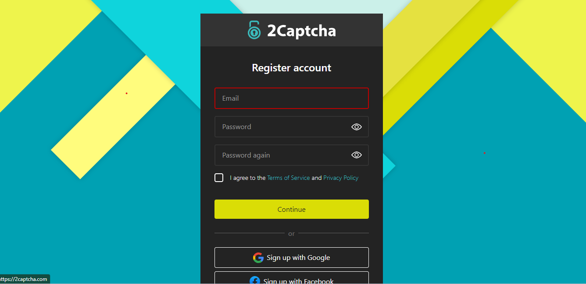

# Easy way to Solve Captcha Using JavaScript & 2Captcha

## Table of Content
- [Easy way to Solve Captcha Using JavaScript \& 2Captcha](#easy-way-to-solve-captcha-using-javascript--2captcha)
  - [Table of Content](#table-of-content)
  - [Introduction](#introduction)
  - [How Captcha works](#how-captcha-works)
  - [What is 2Captcha and how does it work to bypass Captchas?](#what-is-2captcha-and-how-does-it-work-to-bypass-captchas)
  - [Registering and setting up an account on 2Captcha](#registering-and-setting-up-an-account-on-2captcha)
  - [To gain access to the 2Captcha API credentials.](#to-gain-access-to-the-2captcha-api-credentials)
  - [Easy way to Solve Captcha Using JavaScript \& 2Captcha](#easy-way-to-solve-captcha-using-javascript--2captcha-1)
    - [Step 1 - Sign up for a 2Captcha account:](#step-1---sign-up-for-a-2captcha-account)
    - [Step 2 - Obtain the captcha challenge:](#step-2---obtain-the-captcha-challenge)
    - [Step 3 - Make an API request:](#step-3---make-an-api-request)
      - [Code sample using JavaScript and axios library](#code-sample-using-javascript-and-axios-library)
    - [Step 4 - Retrieve the captcha solution:](#step-4---retrieve-the-captcha-solution)
    - [Step 5 - Poll for the solution:](#step-5---poll-for-the-solution)
      - [Code sample using JavaScript and axios library](#code-sample-using-javascript-and-axios-library-1)
    - [Step 6 - Use the captcha solution:](#step-6---use-the-captcha-solution)
  - [Best Practices for Captcha Solving](#best-practices-for-captcha-solving)
  - [Conclusion](#conclusion)
  - [Resources](#resources)
--- 


## Introduction
We've all encountered the frustration of seemingly endless Captcha challenges with no apparent solution. Whether it's deciphering distorted letters, jumbled numbers, or selecting images that fit certain criteria, these obstacles can greatly impede our productivity. While Captcha serves a crucial purpose in distinguishing humans from bots and preventing spam, the truth is that spending hours unraveling these perplexing puzzles is far from desirable.

But don't worry! The good news is that we now have access to many services that can help us easily overcome this hurdle. In this article, we will explore the simplest solution: [2Captcha](https://2captcha.com/). Let's explore how to solve Captcha challenges using the power of 2Captcha and Javascript.

**Are you ready? Let’s get started!**

## How Captcha works

Captcha, an acronym for "Completely Automated Public Turing Test to Tell Computers and Humans Apart," is used to distinguish between people and robots by giving them tasks that are simple for people to complete but challenging for computers. Two straightforward components make up a CAPTCHA test: a text box and a random sequence of letters and/or numbers that appear as a warped image. Simply enter the characters you see in the image into the text box to pass the test and demonstrate your human identity.

There are various types of Captcha challenges, including image-based selection, text-based entry, audio-based challenges, and more. These challenges are designed to prevent automated bots from gaining unauthorized access or submitting spam to websites.

Image-based challenges often require users to select specific images that match certain criteria, such as "select all images with cars" or "click on all images containing traffic lights." Text-based challenges typically involve entering a series of distorted characters or numbers displayed in an image or solving a simple math problem.

To create these puzzles and verify user responses, Captcha uses sophisticated algorithms and artificial intelligence techniques in the background. In order to effectively block out malicious bots, it is necessary to build a barrier that can only be easily surmounted by human intelligence and intuition.

## What is 2Captcha and how does it work to bypass Captchas?

2Captcha is a service that recognizes images and CAPTCHAs. 2Captcha's main objective is to have human employees correctly and quickly solve CAPTCHAs. By using a service called 2Captcha, you can get around Captcha obstacles by delegating work to other people. You can send any Captcha problems you run into while utilizing a website or application to 2Captcha for assistance. 

The task is then given to human employees, who use their intelligence to complete it correctly. When the challenge is successfully completed, the response is sent back to 2Captcha, who then sends it via their API back to your application. Your application will be able to successfully complete the intended action as a result of the Captcha challenge. To put it simply, 2Captcha serves as a middleman, connecting your application with knowledgeable human beings who can successfully solve Captchas. 2Captcha improves the security and usability of online services in this way.

2Captcha supports a wide range of Captcha types, including reCaptcha, hCaptcha, image captcha, normal captcha, and text captcha. Their service is capable of handling these diverse Captcha challenges, ensuring that you can successfully overcome various types of obstacles. 
Click more for information on captchas supported by 2Captcha

## Registering and setting up an account on 2Captcha

You must first register for a 2Captcha account in order to begin using the service to get around Captcha problems. 
Simply visit the (2Captcha registration)[https://2captcha.com/auth/register] and complete the registration process by providing the necessary details.


## To gain access to the 2Captcha API credentials. 
**Log in** to your account and **navigate** to the **API section** or **settings** within your account dashboard. From there, you can get your **API credentials**, usually as a secret key or token. These credentials are essential for authenticating your requests to the 2Captcha API.


Please be aware that the 2Captcha service is not free to use. Tokens are an additional cost, with prices for 1,000 successfully completed CAPTCHAs starting at $0.5. With this payment, you can effectively avoid Captcha challenges by utilizing 2Captcha's capabilities.

## Easy way to Solve Captcha Using JavaScript & 2Captcha

### Step 1 - Sign up for a 2Captcha account:
Visit the (2Captcha website) [https://2captcha.com/] and create an account. Once registered, you will receive an API key that you'll need to authenticate your requests.


### Step 2 - Obtain the captcha challenge: 

Identify the webpage or form where the captcha is present. You'll need to extract the captcha challenge, which can be in the form of an image, text, or audio.

### Step 3 - Make an API request:

Construct an HTTP POST request to the 2Captcha API endpoint (https://2captcha.com/in.php) with the following parameters:

* key: Your 2Captcha API key from your account.
* method: The type of captcha you are solving (image, text, audio, etc.).
* captchafile: If the captcha is an image file, encode it in base64 format and include it as the value of this parameter. For other captcha types, provide the necessary data accordingly.
* pageurl: The URL of the webpage where the captcha is located.

#### Code sample using JavaScript and axios library
```js
const axios = require('axios');

const apiKey = 'YOUR_API_KEY';
const captchaFile = 'BASE64_ENCODED_IMAGE';
const pageUrl = 'URL_OF_THE_PAGE';

axios.post('https://2captcha.com/in.php', {
  key: apiKey,
  method: 'base64',
  captchafile: captchaFile,
  pageurl: pageUrl
})
.then(response => {
  const captchaId = response.data.split('|')[1];
  // Use the captchaId for the next step
})
.catch(error => {
  console.log('Error:', error);
});
```
### Step 4 - Retrieve the captcha solution:
After making the API request, you will receive a response containing the captcha ID. Store this ID for the next step.

### Step 5 - Poll for the solution:
Send periodic GET requests to the 2Captcha API endpoint (https://2captcha.com/res.php) with the following parameters:

* key: Your 2Captcha API key.
* action: The "get" action to retrieve the solution.
* id: The captcha ID obtained in the previous step.

#### Code sample using JavaScript and axios library
```js
const apiKey = 'YOUR_API_KEY';
const captchaId = 'CAPTCHA_ID';

function pollForSolution() {
  axios.get('https://2captcha.com/res.php', {
    params: {
      key: apiKey,
      action: 'get',
      id: captchaId
    }
  })
  .then(response => {
    if (response.data === 'CAPTCHA_NOT_READY') {
      // Solution not yet available, continue polling
      setTimeout(pollForSolution, 2000); // Poll every 2 seconds
    } else {
      const captchaSolution = response.data.split('|')[1];
      // Use the captchaSolution in your application
    }
  })
  .catch(error => {
    console.log('Error:', error);
  });
}

// Start polling for the solution
pollForSolution();

```

### Step 6 - Use the captcha solution:
Once you receive the captcha solution, you can utilize it to fill in the captcha field on the webpage or form where it is required. This allows you to bypass the captcha and proceed with the desired action.

These steps will help you use JavaScript and the 2Captcha service to successfully solve captchas. To ensure that the captcha-solving process in your application runs smoothly, remember to handle errors and implement the appropriate retries.

## Best Practices for Captcha Solving

* Minimize the usage of captchas: Only implement captchas where absolutely necessary to avoid frustrating users.
* Monitor the success rate: Keep track of the success rate of your captcha-solving mechanism and continuously improve it by analyzing failures.
* Use fallback mechanisms: Implement backup captcha-solving techniques in case the 2Captcha service is unavailable or fails to solve the captcha.
* Respect 2Captcha's terms and conditions: Adhere to the usage policies provided by 2Captcha to maintain a good working relationship.

## Conclusion
This tutorial provided a guide on an easy way to Solve Captcha Using JavaScript and the 2Captcha service. By following the steps outlined, you can automate captcha solving for various applications, improving the user experience and streamlining processes that involve captcha challenges. Remember to consider the ethical implications and adhere to any legal and ethical guidelines related to captcha solving. It is essential to respect the terms and conditions of the [2Captcha service](https://2captcha.com/) and implement proper error handling, retries, and security measures to ensure a reliable and secure captcha-solving mechanism.

## Resources
https://www.npmjs.com/package/2captcha-node
https://2captcha.com/api-docs

If you have any questions, do not hesitate to reach out in the comments.

Thanks for reading!
